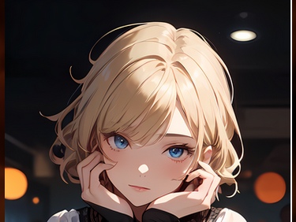

<p align="center">
  
</p>

Chesslise is open source Chess based Discord bot, which allows users to play, learn, watch chess in their Discord server

# Sources

# API

 1. [Lichess API](https://lichess.org/api) 
 2. [Chess.com API](https://github.com/sornerol/chess-com-pubapi-java-wrapper)
 3. [JDA 5 Discord API](https://github.com/DV8FromTheWorld/JDA)
 4. [StockFish API](https://stockfish.online/)

# Libraries

 1. [Lichess Java Client](https://github.com/tors42/chariot) 
 2. [Tors42 JBang-chariot Java Client Examples](https://github.com/tors42/jbang-chariot)
 3. [Chess.com Java Wrapper](https://github.com/sornerol/chess-com-pubapi-java-wrapper)
 4. [Java Chess Lib](https://github.com/bhlangonijr/chesslib)

# Engines

- [Lise Chess Engine](https://github.com/jalpp/LiseChessEngine) 
- [Stockfish](https://stockfishchess.org/)

# Image Generation
- [Lichess Gifs](https://github.com/lichess-org/lila-gif)

# Chesslise High-level Design


# How to add Chesslise to your Discord server
- Head over to [App Directory](https://discord.com/application-directory/930544707300393021)
- Click on "Add to Server"
- If you are not logged in to Discord you might have to log in
- You would have to get a server selection list that you own, pick the server you want to install Lise in
- View Lise's permission and click "Authorize"
- To check if Lise has joined, go to the server where you installed Lise and run /help or /play and see if the LISEBOT selection menu opens up
- Your done! Please read the command information below you can also run /help to view it in Discord.

# How to setup lise locally?

- To set up lise you need to have java 17+, intellJ, and maven
- git clone the project
- use any IDE (IntellJ recommended)
- configure ``` DISCORD_TOKEN ``` for your own bots Discord token
- configure ``` LICHESS_TOKEN ``` if you also want to run lise on Lichess
- you are ready to run the bot with ``` java Main.java ```
- Please note you need to follow same steps as adding Chesslise for your own local bot

# Lichess Commands:
| Commands                   | Description |
|----------------------------| ----------- |
| /help                      | To see command information for the LISEBOT       |
| /profile                   | To see Lichess profiles for given username       |
| /streamers                 | Watch current live streamers |
| /puzzle                    | See the daily Lichess Chesscom puzzle and try to solve it! |
| /play                      | Create an open-ended challenge for Discord users to play with, select time control[1+0,3+0,3+2,5+0,etc] and mode [casual/rated] |
| /arena                     | See the standings and tournament information for the given tournament link|
| /watch                     | View the last Lichess game played by a user  |
| /watchmaster               | View random GM games live in Discord         |
| /broadcast                 | View broadcast info for the current Lichess broadcast |


# Chess.com Commands
| Commands     | Description |
| ----------- | ----------- |
| /puzzle      | Do Daily/Random Chess.com puzzles     |
| /profilecc   | View Chess.com user profile           |


# Engine [Stockfish & Lise] Commands
| Commands     | Description |
| ----------- | ----------- |
| /analyze    |  Pass in FEN to analyze with Stockfish     |
| /move       |  Play Stockfish engine in Discord          |
| /moveblack  |  Play Lise engine in Discord               |


## Create Lichess Games


## Demo

https://youtu.be/ChFw8mT7zBo?si=H5lpF9uOjIKDEIGm

## Terms of Service
The user agrees that they will have to use the latest updated versions of LISEBOT, The User also agrees that some commands may be deleted if the developer does not want to maintain those commands in future. The user is fully responsible for their discord server, and LISEBOT has no access to the server information/ management. The user also agrees to the privacy policy which states that LISEBOT does not and will not store any private information

## Privacy Policy
LISEBOT Does not and will not store any private user information, all bot commands are Lichess, Chess.com, and Stockfish and use slash commands to run commands properly. LISEBOT is not responsible for any user actions on their servers.

## License 
Lise is non-commercial software made for chess lovers to use their loved sites/features in Discord, this software is licensed under GPL, please read the license for more details. LISEBOT will never charge users for its service, users may get the option to donate to devs if they want.

## App Directory 
[View More](https://discord.com/application-directory/930544707300393021)

## Discord Support Server
[Join](https://discord.gg/uncmhknmYg)

## Version number: 11

## Authors:
- @jalpp Main maintainer of Chesslise 
- @ddugovic Thanks for setting up the GitHub yaml file!
- @tors42 Thanks for helping with the chariot integration! 
- @pad918 Thanks for helping out with the watch command!
- @BreakTos Thanks for /learnchess command!


